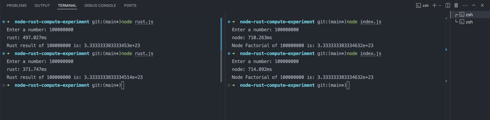

# Backend Perfomance Optimization In NodeJS using Rust with Foreign Function Interface

## :zap: Performance Benchmark



Here's we use **sum of square** matemathical operation to compare the perfomance between nodejs vs node+rust using neon binding.

## Advantages of FFI

- **Reuse old code**: Call code written in other languages without rewriting it.
- **Choose the best language**: Use different languages for different tasks.
- **Improve performance**: Use languages that are good at math and computation to speed up your code.
- **Fix memory problems**: Use languages that are good at handling memory to reduce crashes.
- **Develop faster**: Let developers work in the language they're most comfortable with.
- **Test and prototype quickly**: Test new ideas without spending a lot of time.
- **Use native libraries**: Integrate your code with existing native libraries.
- **Build scalable applications**: Make your application handle more users or data.

## Installing the project
Installing requires a [supported version of Node and Rust](https://github.com/neon-bindings/neon#platform-support).

You can install the project with npm. In the project directory, run:

```sh
$ npm install
```

This fully installs the project, including installing any dependencies and running the build.

## Building the project

If you have already installed the project and only want to run the build, run:

```sh
$ npm run build
```

This command uses the [cargo-cp-artifact](https://github.com/neon-bindings/cargo-cp-artifact) utility to run the Rust build and copy the built library into `./index.node`.

#### `npm build-release`

Same as [`npm build`](#npm-build) but, builds the module with the [`release`](https://doc.rust-lang.org/cargo/reference/profiles.html#release) profile. Release builds will compile slower, but run faster.

### `npm test`

Runs the unit tests by calling `cargo test`. You can learn more about [adding tests to your Rust code](https://doc.rust-lang.org/book/ch11-01-writing-tests.html) from the [Rust book](https://doc.rust-lang.org/book/).


## Exploring rust-compute-experiment

### Run sum of square using NodeJS
```node index.js```
### Run sum of square using NodeJS + Rust
```node rust.js```

## Learn More

To learn more about Neon, see the [Neon documentation](https://neon-bindings.com).

To learn more about Rust, see the [Rust documentation](https://www.rust-lang.org).

To learn more about Node, see the [Node documentation](https://nodejs.org).
